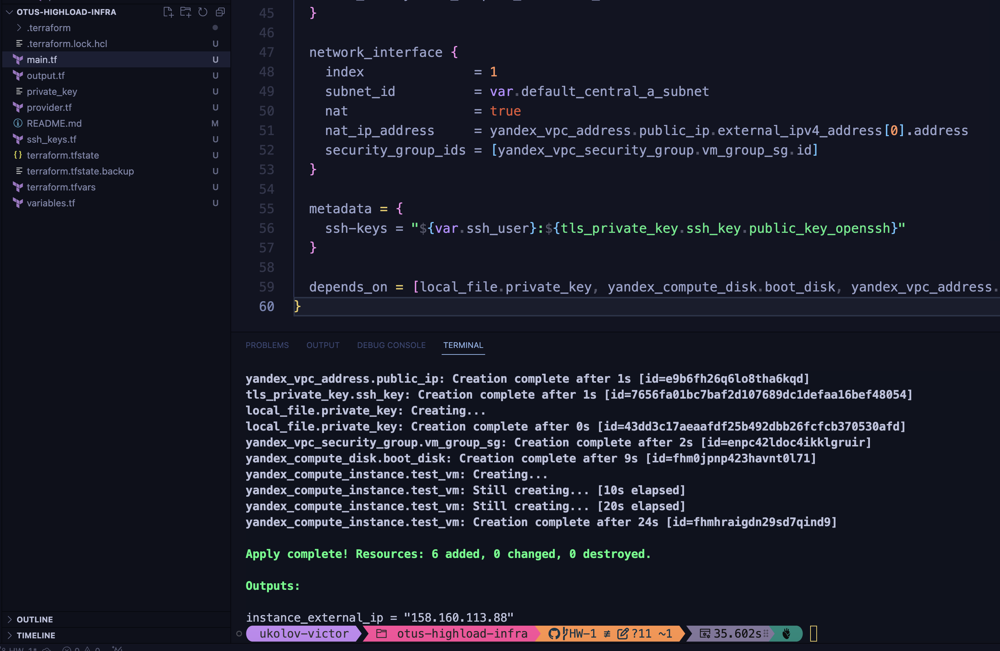
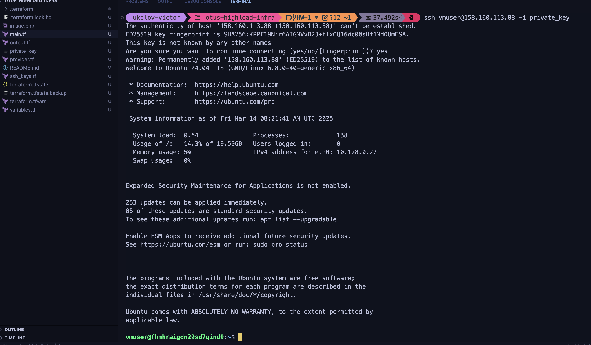

terraform init -> terraform plan -> terraform apply

AUTH ENV: 
export YC_TOKEN=$(yc iam create-token) 
export YC_CLOUD_ID=$(yc config get cloud-id) 
export YC_FOLDER_ID=$(yc config get folder-id) 

